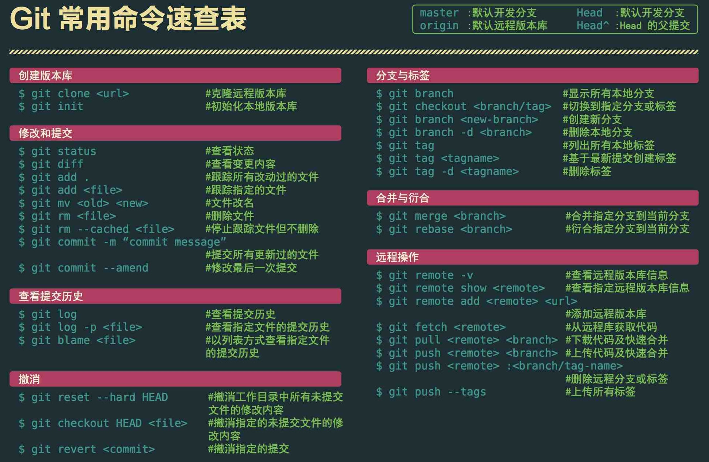

# 操作流程

## 1.检出工程

```bash
$ git clone git@172.18.20.41:cloud-platform/myproject.git
Cloning into 'myproject'...
remote: Enumerating objects: 4, done.
remote: Counting objects: 100% (4/4), done.
remote: Compressing objects: 100% (2/2), done.
remote: Total 4 (delta 0), reused 0 (delta 0)
Receiving objects: 100% (4/4), done.
```

## 2.切换新的假分支

```bash
$ git checkout --orphan new_branch
Switched to a new branch 'new_branch'
```

之所以叫假分支，是因为这个分支没有提交，不算一个真正的分支：

```bash
$ git branch
  master
```

但是这个分支里除了提交记录外，所有内容都存在。

## 3.添加所有文件

```bash
$ git add -A
```

## 4.提交更改

```bash
$ git commit -a -m "clear"
[new_branch (root-commit) 3767997] clear
 1 file changed, 90 insertions(+)
 create mode 100644 .idea/workspace.xml
```

## 5.删除master

```bash
$ git branch -D master
Deleted branch master (was c5d5624).
```

## 6.重命名当前分支

```bash
$ git branch -m master
```

## 7.强制推送

```bash
$ git push -f origin master
Enumerating objects: 4, done.
Counting objects: 100% (4/4), done.
Delta compression using up to 4 threads
Compressing objects: 100% (2/2), done.
Writing objects: 100% (4/4), 1.40 KiB | 1.40 MiB/s, done.
Total 4 (delta 0), reused 3 (delta 0)
To 172.18.20.41:cloud-platform/myproject.git

 + c5d5624...3767997 master -> master (forced update)
```

————————————————
版权声明：本文为CSDN博主「不曾听说」的原创文章，遵循CC 4.0 BY-SA版权协议，转载请附上原文出处链接及本声明。
原文链接：https://blog.csdn.net/a112626290/article/details/104049031

---

